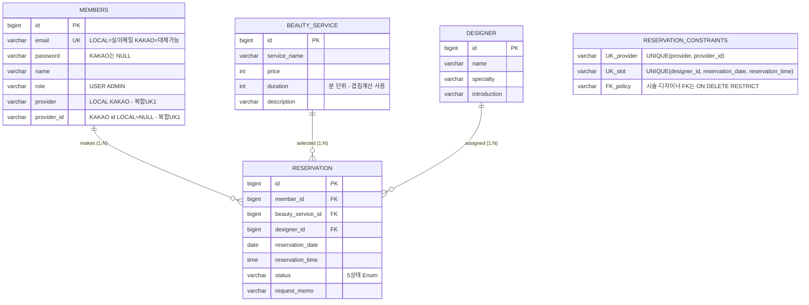
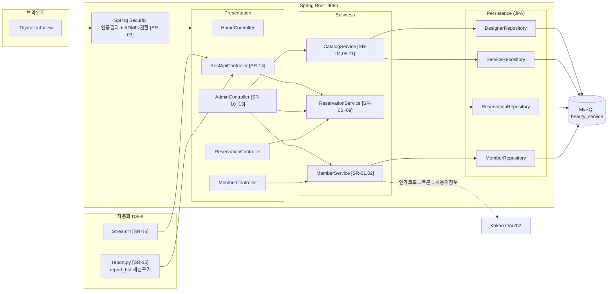
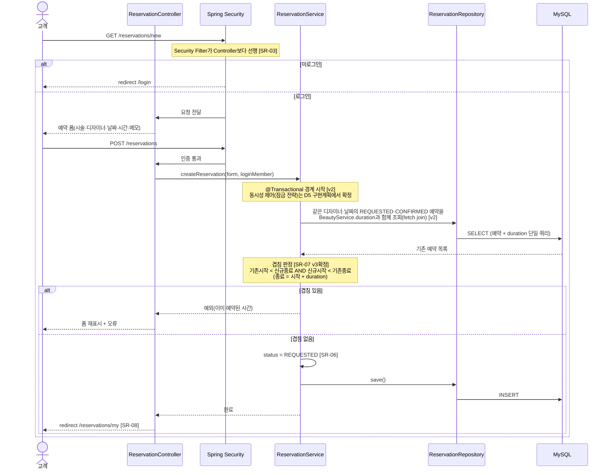
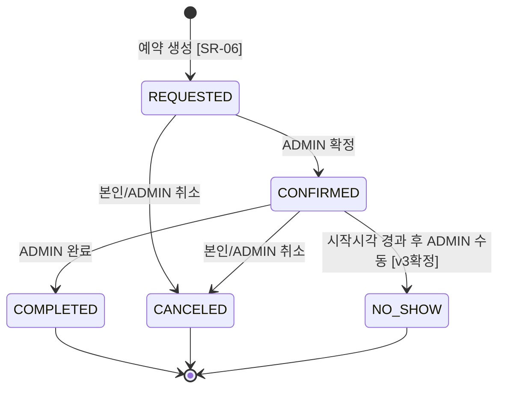

# 뷰티샵 예약 시스템 — SA 다이어그램 소스 (Mermaid)

- 근거: SR 확정본 v3.0 · VR-0720-02 판정 1
- 형식: Mermaid diagram-as-code. GitHub에서 자동 렌더링됨.
- 동반 산출물: 04_component_diagram.pdf (UML 2.5 정식 표기, 클로드 디자인 산출)

---

## 1. ERD (SA-DB)



**설계 판단 [v2 확정]**: ①회원 식별 = 복합 UNIQUE(provider, provider_id), provider_id 단독 UK 없음 [SR-02]. ②이중예약 = 앱 계층 구간겹침 판정 + DB 보조 UNIQUE(designer_id, reservation_date, reservation_time) 이중방어, DDL에 둘 다 명시 [SR-07]. ③예약이 참조하는 시술·디자이너 FK는 ON DELETE RESTRICT — Service 검사 + DB 정책 이중방어 [SR-11].

---

## 2. 컴포넌트 다이어그램 (SA-ARCH)



**설계 근거 [v2]**: 자동화 계층은 API만 소비. AdminController→MemberService = 고객 목록·상세·이메일검색 [SR-12]. RestApiController→ReservationService = 관리자 예약 API 전용 조회 [SR-14]. 인증 로직은 MemberService 격리 — Phase 2 대비.

---

## 3. 시퀀스 다이어그램 — 예약 신청 (UR-06 / SR-06,07)



**[v2] 트랜잭션·동시성**: createReservation은 @Transactional로 실행. D5에서는 동일 디자이너·날짜 예약 생성에 비관적 잠금 등 구간 중복 경쟁조건을 방어할 전략을 확정한다. DB 슬롯 UNIQUE는 동일 시작시각 충돌의 보조 방어로만 사용한다.

**[v2] Repository 책임**: 겹침 조회는 같은 디자이너·날짜·활성상태(REQUESTED·CONFIRMED) 예약과 각 BeautyService.duration을 fetch join으로 함께 취득한다 (N+1 방지, NFR-02 연계).

---

## 4. 상태 전이 다이어그램 (SR-10 전이표)



이외 모든 전이는 거부된다. 검증: 허용 5경로 성공 + 금지 전이 거부.
```
